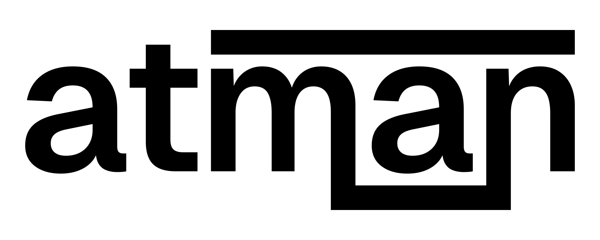

<p align="center">
  
</p>

<h1 align="center">Atman Design System</h1>

<p align="center">
  A lean, accessible, and modern Design System built with Web Components.
  <br />
  <strong>Essence over excess.</strong>
</p>

<p align="center">
  <a href="https://www.npmjs.com/package/atman-ds">
    
  </a>
  <a href="https://opensource.org/licenses/MIT">
    
  </a>
  <a href="https://github.com/craice/atman/actions">
    
  </a>
  <a href="https://craice.github.io/atman">
    
  </a>
  
</p>

<p align="center">
  <a href="#installation">Installation</a> •
  <a href="#quick-start">Quick Start</a> •
  <a href="#components">Components</a> •
  <a href="#theming">Theming</a> •
  <a href="#accessibility">Accessibility</a> •
  <a href="#documentation">Documentation</a>
</p>

---

## Philosophy

**Atman** (आत्मन्) is a Sanskrit word meaning "essence," "soul," or "self." This design system embodies that philosophy — providing only essential components without unnecessary complexity.

- **Essence over excess** — Only essential components, no bloat
- **Universal truth** — Framework-agnostic, works everywhere
- **Inner consistency** — Coherent tokens and patterns throughout
- **Accessible by default** — WCAG AA compliance as baseline

## Installation

```bash
npm install atman-ds
```

## Quick Start

### Import Styles

Include the design tokens in your HTML or import them in your CSS:

```html
<!-- Via link tag -->
<link rel="stylesheet" href="node_modules/atman-ds/dist/tokens/index.css" />
```

Or import in your JavaScript/TypeScript:

```javascript
import 'atman-ds';
```

### Use Components

```html
<!-- Button -->
<atman-button variant="primary">Click me</atman-button>
<atman-button variant="secondary">Secondary</atman-button>
<atman-button variant="ghost">Ghost</atman-button>

<!-- Input -->
<atman-input
  label="Email"
  type="email"
  placeholder="you@example.com"
></atman-input>

<!-- Card -->
<atman-card>
  <h3 slot="header">Card Title</h3>
  <p>Card content goes here.</p>
  <div slot="footer">
    <atman-button variant="primary">Action</atman-button>
  </div>
</atman-card>

<!-- Alert -->
<atman-alert variant="success" alert-title="Success!">
  Your changes have been saved.
</atman-alert>
```

### With React

```jsx
import 'atman-ds';

function App() {
  return (
    <div>
      <atman-button variant="primary" onClick={() => alert('Clicked!')}>
        Click me
      </atman-button>
    </div>
  );
}
```

### With Vue

```vue
<template>
  <atman-button variant="primary" @click="handleClick">
    Click me
  </atman-button>
</template>

<script setup>
import 'atman-ds';

const handleClick = () => {
  alert('Clicked!');
};
</script>
```

## Components

### Primitives

| Component | Description |
|-----------|-------------|
| `<atman-button>` | Buttons with variants: primary, secondary, ghost, destructive |
| `<atman-badge>` | Status indicators with color variants |
| `<atman-avatar>` | User avatars with image, initials, or fallback |
| `<atman-icon>` | Icon wrapper with Lucide icon support |

### Form Controls

| Component | Description |
|-----------|-------------|
| `<atman-input>` | Text input with label, error states, prefix/suffix |
| `<atman-select>` | Dropdown select with keyboard navigation |
| `<atman-checkbox>` | Checkbox with indeterminate state |
| `<atman-radio>` | Radio buttons with group support |

### Feedback

| Component | Description |
|-----------|-------------|
| `<atman-alert>` | Alert messages with variants and dismissible option |
| `<atman-toast>` | Toast notifications with auto-dismiss |
| `<atman-skeleton>` | Loading placeholders |
| `<atman-tooltip>` | Tooltips with placement options |

### Layout

| Component | Description |
|-----------|-------------|
| `<atman-card>` | Container with header, body, and footer slots |
| `<atman-modal>` | Modal dialogs with focus trap |
| `<atman-tabs>` | Tabbed interface with keyboard navigation |
| `<atman-divider>` | Visual separator with optional label |

## Theming

Atman uses CSS Custom Properties for theming. Override tokens to customize the design system:

```css
:root {
  /* Colors */
  --atman-color-primary: #111111;
  --atman-color-success: #1E8E3E;
  --atman-color-warning: #F9AB00;
  --atman-color-destructive: #D93025;

  /* Typography */
  --atman-font-family: 'Geist', sans-serif;
  --atman-font-size-md: 16px;

  /* Spacing */
  --atman-space-4: 16px;

  /* Border Radius */
  --atman-radius-md: 8px;
}
```

### Dark Mode

Enable dark mode by adding `data-theme="dark"` to your document:

```html
<html data-theme="dark">
  ...
</html>
```

Or toggle programmatically:

```javascript
document.documentElement.setAttribute('data-theme', 'dark');
```

## Design Tokens

| Category | Tokens |
|----------|--------|
| **Colors** | Primary, Success, Warning, Destructive, Neutral scale |
| **Spacing** | 4px base unit (4, 8, 12, 16, 24, 32, 48, 64) |
| **Typography** | Sizes (12-48px), Weights (400-700), Line heights |
| **Border Radius** | sm (4px), md (8px), lg (12px), full (9999px) |
| **Shadows** | sm, md, lg, xl |
| **Transitions** | fast (150ms), normal (200ms), slow (300ms) |

## Accessibility

Atman is built with WCAG AA compliance as a baseline. Every component includes:

- **Keyboard navigation** — Full keyboard support for all interactive elements
- **Screen reader support** — Proper ARIA attributes, roles, and live regions
- **Focus management** — Visible focus indicators, focus trapping in modals
- **Color contrast** — All text and UI elements meet minimum contrast ratios
- **Reduced motion** — Animations respect `prefers-reduced-motion`

See the [Accessibility documentation](https://craice.github.io/atman/?path=/story/accessibility) in Storybook for per-component details and testing checklists.

## Figma Integration

Atman tokens can be synced with Figma using the [Tokens Studio](https://tokens.studio/) plugin:

```bash
# Generate Tokens Studio compatible JSON
npm run export-tokens-studio
```

This creates `src/tokens/tokens-studio.json` with three token sets (`global`, `light`, `dark`) ready to import into Figma. See the [Figma Integration Guide](docs/figma-tokens-studio-guide.md) for setup instructions.

## Browser Support

Atman supports all modern browsers (last 2 versions):

- Chrome
- Firefox
- Safari
- Edge

## Documentation

- **[Storybook](https://craice.github.io/atman)** — Interactive component documentation
- **[Figma Integration](docs/figma-tokens-studio-guide.md)** — Tokens Studio setup guide
- **[Accessibility](docs/accessibility-audit.md)** — Accessibility audit and compliance details
- **[GitHub](https://github.com/craice/atman)** — Source code and issues

## Development

```bash
# Install dependencies
npm install

# Start Storybook for development
npm run storybook

# Build the library
npm run build

# Type check
npm run typecheck

# Build Storybook for deployment
npm run build-storybook

# Export tokens for Figma (Tokens Studio format)
npm run export-tokens-studio
```

## Contributing

Contributions are welcome! Please read our contributing guidelines before submitting a pull request.

1. Fork the repository
2. Create your feature branch (`git checkout -b feature/amazing-feature`)
3. Commit your changes (`git commit -m 'Add amazing feature'`)
4. Push to the branch (`git push origin feature/amazing-feature`)
5. Open a Pull Request

## License

MIT License - see the [LICENSE](LICENSE) file for details.